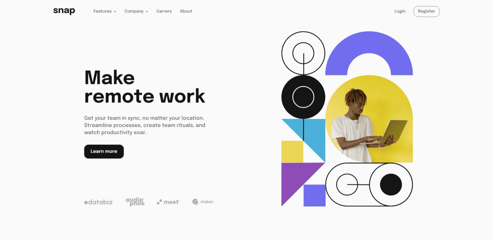

# Frontend Mentor - Intro section with dropdown navigation solution

This is a solution to the [Intro section with dropdown navigation challenge on Frontend Mentor](https://www.frontendmentor.io/challenges/intro-section-with-dropdown-navigation-ryaPetHE5). Frontend Mentor challenges help you improve your coding skills by building realistic projects.

## Table of contents

- [Overview](#overview)
  - [The challenge](#the-challenge)
  - [Screenshot](#screenshot)
  - [Links](#links)
- [My process](#my-process)
  - [Built with](#built-with)
  - [What I learned](#what-i-learned)
  - [Continued development](#continued-development)
  - [Useful resources](#useful-resources)
- [Author](#author)

## Overview

### The challenge

Users should be able to:

- View the relevant dropdown menus on desktop and mobile when interacting with the navigation links
- View the optimal layout for the content depending on their device's screen size
- See hover states for all interactive elements on the page

### Screenshot



### Links

- Solution URL: [Project Solution](https://www.frontendmentor.io/solutions/responsive-and-reactive-landing-page-w-custom-dropdown-menus-CGawEbcTFz)
- Live Site URL: [Project live site](https://snap-landing-page-pi.vercel.app/)

## My process

### Built with

- Semantic HTML5 markup
- Flexbox
- CSS Grid
- Mobile-first workflow
- [SvelteKit](https://kit.svelte.dev/) - JS framework
- [TailwindCss](https://tailwindcss.com/) - Utility-first CSS framework
- [Typescript](https://www.typescriptlang.org/) - Strongly typed JS

### What I learned

I LOVE that you can animate element in and out of the DOM in Svelte w/ a simple if closure on a boolean.

Here open is

```js
<script>
// This is a reactive variable in Svelte. It's like magic.
$: open =  //-- some logic --//
</script>

{#if open}
    <div
      transition:slide={{ duration: 300, easing: quadInOut }}
      use:clickOutside={() => open && setOpenDropdown(null)}
      class="md:absolute min-w-max top-[calc(100%+0.5rem)] flex flex-col md:bg-white md:shadow-lg px-8 py-4  md:p-4 rounded-xl"
    >
      {#each dropdown.items as link (link.id)}
        <NavlinkItem {link} />
      {/each}
    </div>
  {/if}
```

### Continued development

[1] - I need to find a consistent way to scale images from a breakpoint to another with the calc() Css function instead of hard coded values.
[2] - I also will look further into the clamp() CSS function for typography.
=> These two are really great for responsiveness & fluidity

### Useful resources

- [Utopia clamp generator](https://utopia.fyi/) - Fluid type scale calculator.
- [Svelte built in transitions](https://www.tutorialandexample.com/svelte-transition) - This is an amazing article which helped me w/ svelte transitions.
- [Svelte easing functions visualization](https://svelte.dev/repl/6904f0306d6f4985b55f5f9673f762ef?version=3.4.1) - Svelte easing function visualization.

## Author

- Frontend Mentor - [@AntoineC-dev](https://www.frontendmentor.io/profile/AntoineC-dev)
